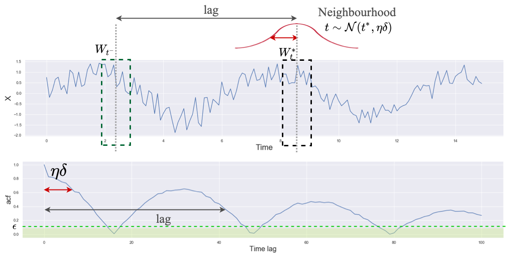
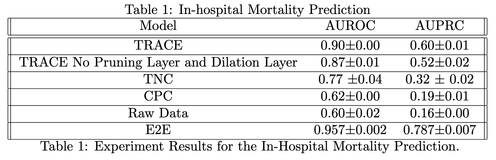
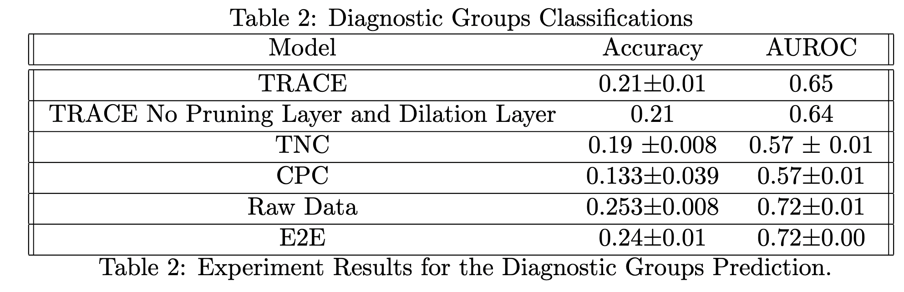
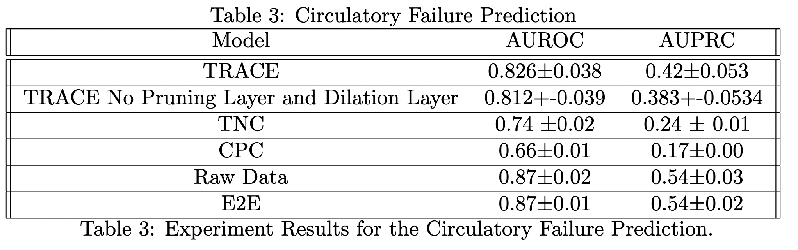
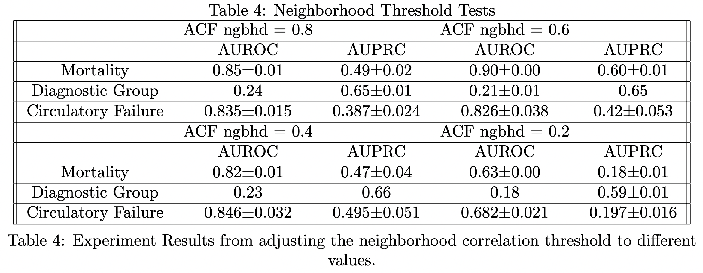
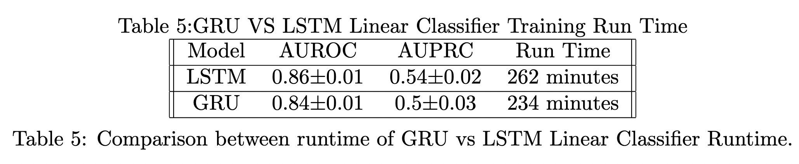

# Reproduction: Learning Unsupervised Representations for ICU Timeseries
with TempoRal AutoCorrelation Encoding (TRACE)



Abstract: Medical time series like physiological signals provide a rich source of information about patients' underlying clinical states. Learning such states is a challenging problem for ML but has great utility for clinical applications. It allows us to identify patients with similar underlying conditions, track disease progression over time, and much more. The challenge with medical time series however, is the lack of well-defined labels for a given patient's state for extended periods of time. Collecting such labels is expensive and often requires substantial effort. In this work, we propose an unsupervised representation learning method, called TRACE, that allows us to learn meaningful patient representations from time series collected in the Intensive Care Unit (ICU). We show the utility and generalizability of these representations in identifying different downstream clinical conditions and also show how the trajectory of representations over time exhibits progression toward critical conditions such as cardiopulmonary arrest or circulatory failure.

Paper Link: https://proceedings.mlr.press/v174/weatherhead22a.html

Experiments were done on 2 datasets. One is a pediatric ICU dataset from The Hospital for Sick Children in Toronto, Ontario, and the other is an ICU dataset from the Department of Intensive Care Medicine of the Bern University Hospital in Switzerland (https://hirid.intensivecare.ai).


# Dependencies
Make sure the code is run in an environment with `Python version 3.10.11`. Before running the code in Google Colab, copy and paste the following commands in a code cell to install the libraries.
```
!pip install torch
!pip install torch torchvision
!pip install pandas
!pip install hdbscan
!pip install umap-learn
!pip install matplotlib
!pip install seaborn
!pip install statsmodels
!pip install pyyaml
```

To run the code in local machine, install the libraries by entering the following command in terminal
```
pip install -r requirements.txt
```
# Setting up Directories
To set up the directories, commence by choosing your root folder. Within your root folder set up the following directories:
```
mkdir ckpt
mkdir DONTCOMMITdata
mkdir DONTCOMMITplots
mkdir gdrive/MyDrive/hirid_numpy
git clone https://github.com/bmurray4/DLH598.git
```

- Directory ckpt will store all checkpoints from TRACE runs
- Directory DONTCOMMITdata will store data downloaded from the physionet website
- Directory DONTCOMMITPLOTS will store plots generated from subsequent runs
- Directory gdrive/MyDrive/hirid_numpy will store processed hirid data
- Directory DLH598 stores all the models pulled from the git repository

# Download Data
To download the data one must obtain access to the data from the PhysioNet website by applying at the following link: https://physionet.org/content/hirid/1.1.1/.

All data is to be downloaded and saved within the DONTCOMMITdata directory.

# Proccess Data

To process the data one must first change the directory to `DLH598` by running the following:
```
cd DLH598
```
Then one must run the following python command to proccess the data:

```
python3 hirid_process.py
```
The command must be ran twice, the first time is to be ran with process_mortality in line 374 set to true and process_circulatory in line 375 set to false. This will proccess the data for mortality rate calculations. The second time must be ran with process_mortality in line 374 set to false and process_circulatory in line 375 set to true to proccess the data for circulatory failure calculations.

# Training the Encoder

To train our encoder on the HiRID dataset, ensure you are in the `DLH598` directory of this repo.
Run the followwing command:
```
python3 -u -m tnc_for_hyper_param_optimization --train --cont --ID 0000 --plot_embeddings --encoder_type CausalCNNEncoder --window_size 12 --w 0.05 --batch_size 30 --lr .00005 --decay 0.0005 --mc_sample_size 6 --n_epochs 150 --data_type HiRID --n_cross_val_encoder 1 --ETA 4 --ACF_PLUS --ACF_nghd_Threshold 0.6 --ACF_out_nghd_Threshold 0.1 --CausalCNNEncoder_in_channels 36 --CausalCNNEncoder_channels 4 --CausalCNNEncoder_depth 1 --CausalCNNEncoder_reduced_size 2 --CausalCNNEncoder_encoding_size 10 --CausalCNNEncoder_kernel_size 2 --CausalCNNEncoder_window_size 12 --n_cross_val_classification 3 
```

The following command will train the TRACE encoder and store the resulting model within the following directory ckpt/HiRID/. The TRACE model will be saved based on it's user provided ID on the above command line. Example the model for ID 0000 will be store as `0000_CausalCNNEncoder_HiRID_checkpoint_0.tar`

# Running the models

The following is how to run your model against the processed dataset:

## In-hospital Mortality

### TRACE
From the `DLH598` directory run the following command:
```
python3 -u -m tnc_for_hyper_param_optimization --train --cont --ID 0000 --plot_embeddings --encoder_type CausalCNNEncoder --window_size 12 --w 0.05 --batch_size 30 --lr .00005 --decay 0.0005 --mc_sample_size 6 --n_epochs 150 --data_type HiRID --n_cross_val_encoder 1 --ETA 4 --ACF_PLUS --ACF_nghd_Threshold 0.6 --ACF_out_nghd_Threshold 0.1 --CausalCNNEncoder_in_channels 36 --CausalCNNEncoder_channels 4 --CausalCNNEncoder_depth 1 --CausalCNNEncoder_reduced_size 2 --CausalCNNEncoder_encoding_size 10 --CausalCNNEncoder_kernel_size 2 --CausalCNNEncoder_window_size 12 --n_cross_val_classification 3 
```

If the id is set to an ID of a previously trained TRACE encoder, the command will load the encoder and train a linear classifier model to predict the mortality rate. If not, the program will first train an TRACE encoder and then proceed to train the linear classifier.

### TNC 
Changing your working directory to `tnc` folder,
```
cd ./DLH598/tnc
```

Run the code in `tnc.py`
```
python -u -m tnc --train --ID 0001 --plot_embeddings --circulatory_failure --checkpoint_file ./0001_CausalCNNEncoder_HiRID_checkpoint_0_tnc.tar
```

### CPC 
Changing your working directory to `baselines` folder,
```
cd ./DLH598/baselines
```

Run the code in `cpc.py`,
```
python -u -m cpc --data HiRID
```

### T-Loss 
Changing your working directory to `baselines` folder,
```
cd ./DLH598/baselines
```

Run the code in `triplet_loss.py`,
```
python -u -m triplet_loss --data HiRID
```

### raw
Changing your working directory to `baselines` folder,
```
cd ./DLH598/baselines
```

Run the code in `raw.py`,
```
python -u -m raw --data HiRID
```


### E2E
Changing your working directory to `baselines` folder,
```
cd ./DLH598/baselines
```

Run the code in `e2e.py`,
```
python -u -m e2e --data HiRID
```

## Clinical Diagnostic Group
### TRACE
From the `DLH598` directory run the following command
```
python3 -u tnc/apache_group_prediction.py --encoder_type TNC_ICU --checkpoint_file  ../ckpt/HiRID/0000_CausalCNNEncoder_HiRID_checkpoint_0.tar
```
Where the checkpoint file corresponds to a previously trained encoder.

### TNC
Changing your working directory to `tnc` folder,
```
cd ./DLH598/tnc
```

Run the code in `apache_group_prediction.py`
```
python -u -m apache_group_prediction  --checkpoint_file ./0001_CausalCNNEncoder_HiRID_checkpoint_0_tnc.tar --encoder_type TNC
```

***Note: Make sure to run cpc.py, triplet_loss.py and raw.py to perform the experiment for in-hospital before performing the experiment for diagnostic group because apache_group_prediction.py needs to read the generated checkpoint files from run cpc.py, triplet_loss.py and raw.py in order to run***

### CPC
Changing your working directory to `tnc` folder,
```
cd ./DLH598/baselines
```

Run the code in `apache_group_prediction.py`
```
python -u -m apache_group_prediction 
```

### T-Loss 
Changing your working directory to `tnc` folder,
```
cd ./DLH598/baselines
```

Run the code in `apache_group_prediction.py`
```
python -u -m apache_group_prediction 
```

### raw
Changing your working directory to `tnc` folder,
```
cd ./DLH598/baselines
```

Run the code in `apache_group_prediction.py`
```
python -u -m apache_group_prediction 
```

### E2E
Changing your working directory to `tnc` folder,
```
cd ./DLH598/tnc
```

Run the code in `e2e_apache_group_prediction.py`,
```
python -u -m e2e_apache_group_prediction
```

## Circulatory Failure
### TRACE
From the `DLH598` directory run the following command
```
python3 -u tnc/circulatory_failure_prediction.py --encoder_type TNC_ICU --checkpoint_file ../ckpt/HiRID/0000_CausalCNNEncoder_HiRID_checkpoint_0.tar
```
Where the checkpoint file corresponds to a previously trained encoder.

### TNC
Changing your working directory to `tnc` folder,
```
cd ./DLH598/tnc
```

Run the code in `circulatory_failure_prediction.py`
```
python -u -m circulatory_failure_prediction --checkpoint_file ./0001_CausalCNNEncoder_HiRID_checkpoint_0_tnc.tar --encoder_type TNC
```

### CPC
Changing your working directory to `tnc` folder,
```
cd ./DLH598/tnc
```

Run the code in `circulatory_failure_prediction.py`
```
python -u -m circulatory_failure_prediction --encoder_type CPC
```

### T-Loss 
Changing your working directory to `tnc` folder,
```
cd ./DLH598/tnc
```

Run the code in `circulatory_failure_prediction.py`
```
python -u -m circulatory_failure_prediction --encoder_type triplet_loss
```

### raw
Changing your working directory to `tnc` folder,
```
cd ./DLH598/tnc
```

Run the code in `circulatory_failure_prediction.py`
```
python -u -m circulatory_failure_prediction --encoder_type raw
```

### E2E
Changing your working directory to `tnc` folder,
```
cd ./DLH598/tnc
```

Run the code in `e2e_circulatory_failure_prediction.py`,
```
python -u -m e2e_circulatory_failure_prediction
```

# Running Ablations/HyperParameters Modifications

The following ablations/hyperparameters modifications have been discussed in the project proposal:

1. Change the AutoCorrelation threshold and plot results of the effects of the change in threshold.

2. Remove the Pruning and Dilation layers from the Trace encoder and run the model with a fixed encoding size (no downsizing).

3. Change the LSTM RNN Classifier model to GRU and plot it's performance difference's.

## Autocorrolation Threshold Modification
To run item 1 for the modification of the HyperParamter of the Autocorrolation threshold one must run the encoder altering the ACF_nghd_Threshold value to a number between 0 and 1. The higher the number the more correlated the neighborhoods will be, the lower the number the less correlated the neighborhood will be. Example with ACF_nghd_Threshold = 0.4
```
python3 -u -m tnc_for_hyper_param_optimization --train --cont --ID 0000 --plot_embeddings --encoder_type CausalCNNEncoder --window_size 12 --w 0.05 --batch_size 30 --lr .00005 --decay 0.0005 --mc_sample_size 6 --n_epochs 150 --data_type HiRID --n_cross_val_encoder 1 --ETA 4 --ACF_PLUS --ACF_nghd_Threshold 0.4 --ACF_out_nghd_Threshold 0.1 --CausalCNNEncoder_in_channels 36 --CausalCNNEncoder_channels 4 --CausalCNNEncoder_depth 1 --CausalCNNEncoder_reduced_size 2 --CausalCNNEncoder_encoding_size 10 --CausalCNNEncoder_kernel_size 2 --CausalCNNEncoder_window_size 12 --n_cross_val_classification 3 
```
## Removing Pruning Layer and Dilation Layer
To run item 2 for the ablation of removing the TRACE's model pruning layer and dilation layer within the encoder, a new encoding model was created called CausalCNNEncoderNoDilationNoPruning. To run the model use the following command.
```
python3 -u -m tnc_for_hyper_param_optimization --train --cont --ID 0000 --plot_embeddings --encoder_type CausalCNNEncoderNoDilationNoPruning --window_size 12 --w 0.05 --batch_size 30 --lr .00005 --decay 0.0005 --mc_sample_size 6 --n_epochs 150 --data_type HiRID --n_cross_val_encoder 1 --ETA 4 --ACF_PLUS --ACF_nghd_Threshold 0.6 --ACF_out_nghd_Threshold 0.1 --CausalCNNEncoder_in_channels 36 --CausalCNNEncoder_channels 4 --CausalCNNEncoder_depth 1 --CausalCNNEncoder_reduced_size 2 --CausalCNNEncoder_encoding_size 10 --CausalCNNEncoder_kernel_size 2 --CausalCNNEncoder_window_size 12 --n_cross_val_classification 3 
```
## Training Classifier on GRU VS LSTM
To run item 3 for the modification of the HyperParamter of the model used within the RNN classifier, one must add the flag `classifierModel` and set to `GRU`. If no flag is provided, model will default to `LSTM`.

### To Calculate Mortality Rate
From the `DLH598` directory run the following command
```
python3 -u -m tnc_for_hyper_param_optimization --train --cont --ID 0000 --plot_embeddings --encoder_type CausalCNNEncoder --window_size 12 --w 0.05 --batch_size 30 --lr .00005 --decay 0.0005 --mc_sample_size 6 --n_epochs 150 --data_type HiRID --n_cross_val_encoder 1 --ETA 4 --ACF_PLUS --ACF_nghd_Threshold 0.6 --ACF_out_nghd_Threshold 0.1 --CausalCNNEncoder_in_channels 36 --CausalCNNEncoder_channels 4 --CausalCNNEncoder_depth 1 --CausalCNNEncoder_reduced_size 2 --CausalCNNEncoder_encoding_size 10 --CausalCNNEncoder_kernel_size 2 --CausalCNNEncoder_window_size 12 --n_cross_val_classification 3 --classifierModel GRU
```

### To Calculate Clinical Diagnostic Groups
From the `DLH598` directory run the following command:
```
python3 -u tnc/apache_group_prediction.py --encoder_type TNC_ICU --checkpoint_file  ../ckpt/HiRID/0000_CausalCNNEncoder_HiRID_checkpoint_0.tar --classifierModel GRU
```
Where the checkpoint file corresponds to a previously trained encoder.

### To Calculate Circulatory Failure
From the `DLH598` directory run the following command
```
python3 -u tnc/circulatory_failure_prediction.py --encoder_type TNC_ICU --checkpoint_file ../ckpt/HiRID/0000_CausalCNNEncoder_HiRID_checkpoint_0.tar --classifierModel GRU
```
Where the checkpoint file corresponds to a previously trained encoder.

# Results
## Reproducibility Results






## Ablation Studies Results



# GitHub repo
The original paper's code can be accessed from this [GitHub Link](https://github.com/Addison-Weatherhead/TRACE).

# Citation
Weatherhead, A., Greer, R., Moga, M., Mazwi, M., Eytan, D., Goldenberg, A. &amp; Tonekaboni, S.. (2022). Learning Unsupervised Representations for ICU Timeseries. Proceedings of the Conference on Health, Inference, and Learnin, in Proceedings of Machine Learning Research 174:152-168 Available from https://proceedings.mlr.press/v174/weatherhead22a.html.
